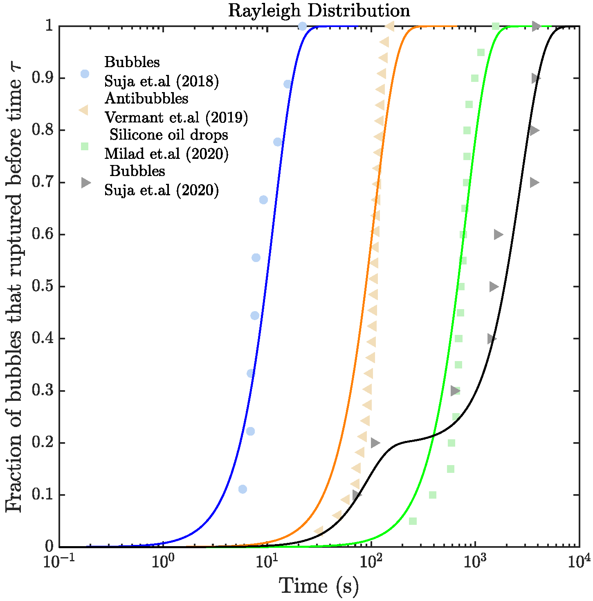

# Cumulative Coalescence Time Distributions
Matlab scripts for plotting the cumulative coalescence time distributions and fitting them to (a) Rayleigh Distribution (function -  EMRayleigh) or (b) Weibull Distribution (function -  EMWeibull) or  (c) Villermaux Distribution (function -  EMVillermaux).  The provided scripts utilize the Expectation Maximization Method for obtaining the scale and shape (when applicable) parameters.

The provided test script shows how to use the function EMRayleigh to plot the cumulative coalescence time distributions and fit it to Rayleigh distribution. An output obtained with the provided sample data is shown below:

Fig: Coalescence time distributions for the sample data fit to a Rayleigh distribution.  
